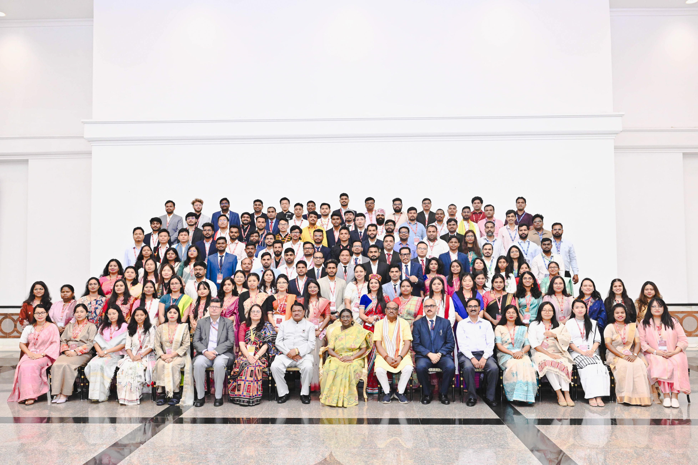

{fig-align="center" width="3000"}

It was an incredible honor to have the opportunity to interact with the Hon'ble President of India. This marks a deeply proud milestone that I will cherish forever, particularly as the first graduate in my family to achieve this level of academic recognition.

## Discussing National Forestry Goals

During our professional dialogue, we focused heavily on the critical intersection of forest dynamics research and climate resilience. I had the privilege of sharing insights from my recent academic journey at **Wageningen University & Research** in the Netherlands, specifically highlighting our team's work on tropical secondary forest successions and soil organic carbon tracking.

Key discussion themes included: \* **Nature Conservation:** Implementing data-driven frameworks to restore degraded tropical ecosystems. \* **Policy Integration:** Bridging the gap between empirical ecological datasets and actionable national environmental policies. \* **Academic Empowerment:** How international fellowships pave the way for impactful local research.

> "Advancing forestry research isn't just an academic pursuit—it is a foundational pillar for securing our global climate future."

## The Impact of the National Overseas Scholarship (NOS)

Receiving the *National Overseas Scholarship (NOS)* was the pivotal catalyst that allowed me to pursue advanced research in forest and nature conservation on an international stage. This prestigious award opened doors to global scientific networks, and meeting the President further reinforces my commitment to bringing rigorous, reproducible data-driven workflows back to the field of forest ecology.

Moving forward, I plan to leverage these experiences to expand my research output, publish further tracking models on soil dynamics, and mentor upcoming scholars in leveraging R programming for ecological analysis.
